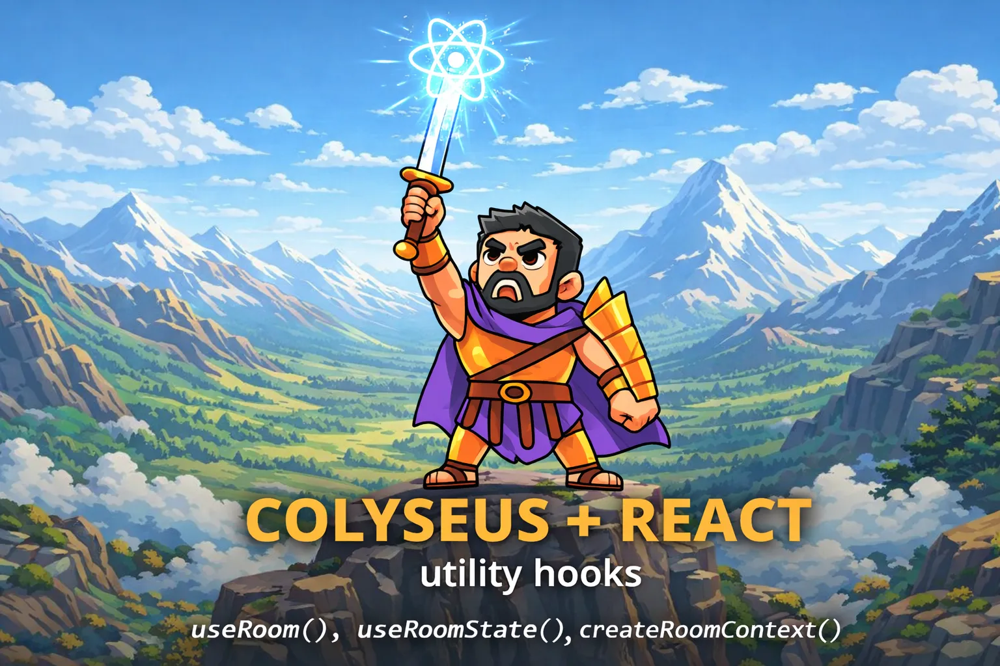

# @colyseus/react

React hooks for [Colyseus](https://colyseus.io/) multiplayer applications.



## Installation

```bash
npm install @colyseus/react
```

**Peer dependencies:** `@colyseus/sdk`, `@colyseus/schema`, and `react` (>=18.3.1).

## Hooks

### `useRoom(callback, deps?)`

Manages the lifecycle of a Colyseus room connection. Handles connecting, disconnecting on unmount, and reconnecting when dependencies change. Works correctly with React StrictMode.

```tsx
import { Client } from "@colyseus/sdk";
import { useRoom } from "@colyseus/react";

const client = new Client("ws://localhost:2567");

function Game() {
  const { room, error, isConnecting } = useRoom(
    () => client.joinOrCreate("game_room"),
  );

  if (isConnecting) return <p>Connecting...</p>;
  if (error) return <p>Error: {error.message}</p>;

  return <GameView room={room} />;
}
```

The first argument is a callback that returns a `Promise<Room>` — any Colyseus matchmaking method works (`joinOrCreate`, `join`, `create`, `joinById`, `consumeSeatReservation`).

**Reconnecting on dependency changes:**

```tsx
const { room } = useRoom(
  () => client.joinOrCreate("game_room", { level }),
  [level],
);
```

When `level` changes the previous room is left and a new connection is established.

**Conditional connection:**

Pass a falsy value to skip connecting until a condition is met:

```tsx
const { room } = useRoom(
  isReady ? () => client.joinOrCreate("game_room") : null,
  [isReady],
);
```

### `useRoomState(room, selector?)`

Subscribes to Colyseus room state changes and returns immutable plain-object snapshots. Unchanged portions of the state tree keep referential equality between renders, so React components only re-render when the data they use actually changes.

```tsx
import { useRoom, useRoomState } from "@colyseus/react";

function Game() {
  const { room } = useRoom(() => client.joinOrCreate("game_room"));
  const state = useRoomState(room);

  if (!state) return <p>Waiting for state...</p>;

  return <p>Players: {state.players.size}</p>;
}
```

**Using a selector** to subscribe to a subset of the state:

```tsx
const players = useRoomState(room, (state) => state.players);
```

Only components that read `players` will re-render when the players map changes.

### `useRoomMessage(room, type, callback)`

Subscribes to Colyseus room messages. The callback is kept in a ref so it is always up-to-date without re-subscribing. Automatically unsubscribes when the room changes or the component unmounts.

```tsx
import { useRoom, useRoomMessage } from "@colyseus/react";

function Chat() {
  const { room } = useRoom(() => client.joinOrCreate("game_room"));
  const [messages, setMessages] = useState<string[]>([]);

  useRoomMessage(room, "chat", (message) => {
    setMessages((prev) => [...prev, message]);
  });

  return (
    <ul>
      {messages.map((msg, i) => <li key={i}>{msg}</li>)}
    </ul>
  );
}
```

Pass `"*"` as the type to listen to all message types.

### `useLobbyRoom(callback, deps?)`

Connects to a Colyseus [Lobby Room](https://docs.colyseus.io/builtin-rooms/lobby/) and provides a live-updating list of available rooms. The list is automatically maintained as rooms are created, updated, and removed.

```tsx
import { Client } from "@colyseus/sdk";
import { useLobbyRoom } from "@colyseus/react";

const client = new Client("ws://localhost:2567");

function Lobby() {
  const { rooms, error, isConnecting } = useLobbyRoom(
    () => client.joinOrCreate("lobby"),
  );

  if (isConnecting) return <p>Connecting...</p>;
  if (error) return <p>Error: {error.message}</p>;

  return (
    <ul>
      {rooms.map((room) => (
        <li key={room.roomId}>
          {room.name} — {room.clients}/{room.maxClients} players
        </li>
      ))}
    </ul>
  );
}
```

**Return value:**

| Field | Type | Description |
|---|---|---|
| `rooms` | `RoomAvailable<Metadata>[]` | Live list of available rooms |
| `room` | `Room \| undefined` | The underlying lobby room connection |
| `error` | `Error \| undefined` | Connection error, if any |
| `isConnecting` | `boolean` | `true` while connecting to the lobby |

### `useQueueRoom(connect, consume, deps?)`

Manages the full lifecycle of a Colyseus matchmaking queue: connecting to the queue room, tracking group size, receiving a seat reservation, confirming, and consuming the seat to join the match room. Cleans up both rooms on unmount.

```tsx
import { Client } from "@colyseus/sdk";
import { useQueueRoom } from "@colyseus/react";

const client = new Client("ws://localhost:2567");

function Matchmaking() {
  const { room, clients, isWaiting, error } = useQueueRoom(
    () => client.joinOrCreate("queue", { rank: 1200 }),
    (reservation) => client.consumeSeatReservation(reservation),
  );

  if (error) return <p>Error: {error.message}</p>;
  if (room) return <GameScreen room={room} />;
  if (isWaiting) return <p>Waiting for match... {clients} players in group</p>;
  return <p>Connecting...</p>;
}
```

The first argument connects to the queue room. The second argument is called with the `SeatReservation` once a match is found — use `client.consumeSeatReservation()` to join the match room.

**Return value:**

| Field | Type | Description |
|---|---|---|
| `room` | `Room \| undefined` | The match room, once the seat has been consumed |
| `queue` | `Room \| undefined` | The queue room while waiting (undefined after match is joined) |
| `clients` | `number` | Number of clients in the current matchmaking group |
| `seat` | `SeatReservation \| undefined` | The seat reservation, once received |
| `error` | `Error \| undefined` | Connection or matchmaking error |
| `isWaiting` | `boolean` | `true` while connected to the queue and waiting for a match |

## Contexts

### `createRoomContext()`

Creates a set of hooks and a `RoomProvider` component that share a single room connection across React reconciler boundaries (e.g. DOM + React Three Fiber). The room is stored in a closure-scoped external store rather than React Context, so the hooks work in any reconciler tree that imports them.

```tsx
import { Client } from "@colyseus/sdk";
import { createRoomContext } from "@colyseus/react";

const client = new Client("ws://localhost:2567");

const { RoomProvider, useRoom, useRoomState } = createRoomContext();
```

**Wrap your app with `RoomProvider`:**

```tsx
function App() {
  return (
    <RoomProvider connect={() => client.joinOrCreate("game_room")}>
      <UI />
      <Canvas>
        <GameScene />
      </Canvas>
    </RoomProvider>
  );
}
```

`RoomProvider` accepts a `connect` callback (same as the standalone `useRoom` hook) and an optional `deps` array. Pass a falsy value to `connect` to defer the connection.

**Use the hooks in any component — DOM or R3F:**

```tsx
function UI() {
  const { room, error, isConnecting } = useRoom();
  const players = useRoomState((state) => state.players);

  if (isConnecting) return <p>Connecting...</p>;
  if (error) return <p>Error: {error.message}</p>;

  return <p>Players: {players?.size}</p>;
}
```

The returned `useRoom()` and `useRoomState(selector?)` work identically to the standalone hooks but don't require you to pass the room as an argument.

### `createLobbyContext()`

Creates a `LobbyProvider` and `useLobby` hook for sharing lobby room data globally across your app — useful when you need room metadata available persistently alongside an active game room, not just on a lobby screen. Like `createRoomContext`, it uses a closure-scoped external store so the hook works across reconciler boundaries.

```tsx
import { Client } from "@colyseus/sdk";
import { createLobbyContext, createRoomContext } from "@colyseus/react";

const client = new Client("ws://localhost:2567");

const { LobbyProvider, useLobby } = createLobbyContext<MyMetadata>();
const { RoomProvider, useRoom, useRoomState } = createRoomContext();
```

**Wrap your app with `LobbyProvider` (can nest with `RoomProvider`):**

```tsx
function App() {
  return (
    <LobbyProvider connect={() => client.joinOrCreate("lobby")}>
      <RoomProvider connect={() => client.joinOrCreate("game_room")}>
        <UI />
        <Canvas>
          <GameScene />
        </Canvas>
      </RoomProvider>
    </LobbyProvider>
  );
}
```

`LobbyProvider` accepts a `connect` callback (same as `useLobbyRoom`) and an optional `deps` array. The lobby connection persists independently of the game room.

**Access lobby data from any component — even deep inside the game:**

```tsx
function RoomBrowser() {
  const { rooms, error, isConnecting } = useLobby();

  if (isConnecting) return <p>Loading rooms...</p>;
  if (error) return <p>Error: {error.message}</p>;

  return (
    <ul>
      {rooms.map((room) => (
        <li key={room.roomId}>
          {room.metadata.displayName} — {room.clients}/{room.maxClients}
        </li>
      ))}
    </ul>
  );
}
```

The returned `useLobby()` hook provides the same fields as `useLobbyRoom` (`rooms`, `room`, `error`, `isConnecting`).

## Credits

Inspiration and previous work by [@pedr0fontoura](https://github.com/pedr0fontoura) — [use-colyseus](https://github.com/pedr0fontoura/use-colyseus/).
